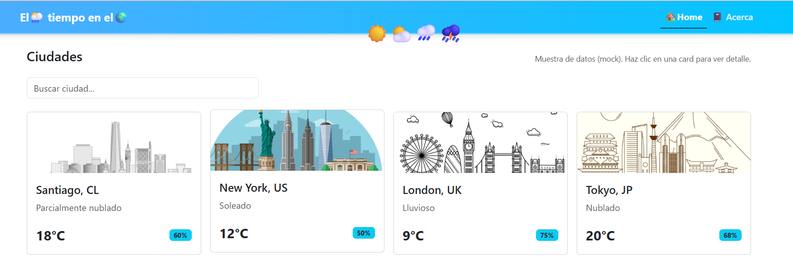
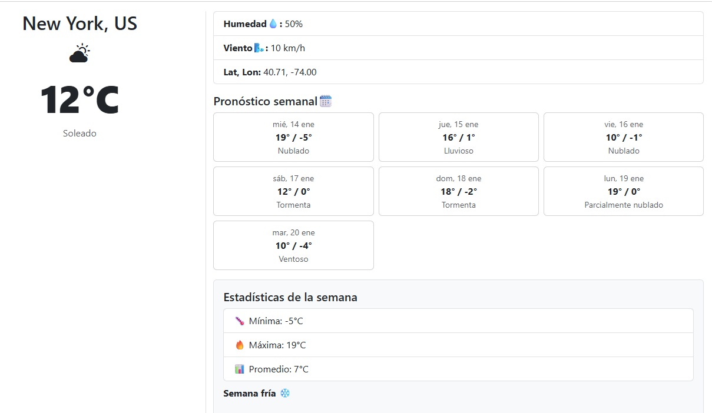

# 🌤️ Weather Frontend —  Módulo 5

# Weather App – JavaScript POO & API

Proyecto educativo desarrollado para el **Bootcamp FrontEnd Trainee SENCE 2025**.

Esta versión corresponde al **Módulo 5** y continúa el trabajo realizado en los **Módulos 2, 3 y 4**, evolucionando la App de Clima desde datos mock y foco visual, hacia una **arquitectura basada en Programación Orientada a Objetos (POO)** y **consumo de datos mediante una API de clima**, utilizando programación asíncrona con JavaScript moderno (ES6+).

---

## Descripción

Aplicación de clima que muestra información meteorológica de distintas ciudades del mundo.  
La app presenta:

- Clima actual
- Pronóstico semanal
- Estadísticas climáticas
- Alertas simples basadas en reglas

En los módulos anteriores, los datos de clima eran **ficticios (mock data)** definidos completamente en JavaScript.  
En esta versión, la información climática **deja de estar fija** y pasa a obtenerse **desde una API de clima**, integrando programación asíncrona (`fetch`, promesas y manejo de errores).

El proyecto mantiene la estética, estructura visual y modularización de estilos trabajadas previamente con **SASS, BEM y Bootstrap**, pero ahora el foco principal está en **la organización del código JavaScript y la lógica de la aplicación**.

---

## Objetivo de esta versión (Módulo 5)

- Reestructurar la lógica de la App utilizando **Programación Orientada a Objetos**.
- Consumir datos de clima desde una **API externa**.
- Aplicar funcionalidades modernas de **JavaScript ES6+**.
- Mantener y recalcular las **estadísticas semanales** a partir de datos obtenidos dinámicamente.
- Incorporar una sección básica de **alertas climáticas**.

---

## Estructura de clases

### WeatherApp
Clase principal de la aplicación. Es responsable de:

- Gestionar las ciudades disponibles.
- Coordinar la obtención de datos desde la API.
- Procesar el pronóstico semanal.
- Calcular estadísticas climáticas.
- Entregar la información necesaria para renderizar la interfaz.

Métodos principales:
- `getCityById(id)`
- `loadWeeklyFromApi(city)`
- `calculateWeeklyStats(weeklyForecast)`

---

### WeatherApi
Clase encargada de la comunicación con la API de clima.

Responsabilidades:
- Realizar peticiones HTTP usando `fetch`.
- Procesar respuestas JSON.
- Manejar errores simples cuando la API no responde correctamente.

---

## Programación asíncrona y consumo de API

- Se utiliza **Fetch API** para obtener datos climáticos.
- El manejo asíncrono se realiza mediante:
  - Promesas (`then / catch`)
  - Manejo de errores con mensajes visibles en la interfaz.
- Los datos recibidos se transforman al formato interno de la aplicación para reutilizar la lógica existente.

En caso de error, la aplicación muestra un mensaje indicando que el pronóstico no pudo cargarse.

---

## Estadísticas semanales

A partir del pronóstico semanal obtenido desde la API, la aplicación calcula dinámicamente:

- Temperatura mínima de la semana.
- Temperatura máxima de la semana.
- Temperatura promedio.
- Cantidad de días por tipo de clima.
- Resumen textual automático del comportamiento climático semanal.

Esta lógica reutiliza y evoluciona el trabajo realizado en el **Módulo 4**, ahora aplicado a datos dinámicos.

---

## Alertas de clima

En la vista de detalle de cada ciudad se muestra una sección de **alertas climáticas simples**, basadas en reglas como:

- Semana fría.
- Semana con varias lluvias.
- Clima mayormente soleado.

Las alertas se generan automáticamente a partir de las estadísticas calculadas.

---

## Metodología de estilos

Se mantiene la metodología **BEM (Bloque, Elemento, Modificador)** para asegurar claridad, consistencia y escalabilidad en los estilos.

Los estilos continúan modularizados con **SASS**, reutilizando variables, mixins y parciales desarrollados en módulos anteriores.

---

## 🚀 Características principales

- Vista **Home** con listado de ciudades y clima actual.
- Vista **Detalle** con pronóstico semanal obtenido desde la API.
- Estadísticas semanales calculadas dinámicamente.
- Alertas climáticas simples.
- Navegación mediante **hash routing** (`#home`, `#city=id`).
- Interfaz responsiva con **Bootstrap**.
- Código organizado usando **POO y ES6+**.
- Manejo básico de errores de carga.
- Control de versiones con **Git y GitHub**.

---

## 🛠️ Tecnologías utilizadas

- **HTML5**
- **SASS** (arquitectura modular)
- **Bootstrap**
- **JavaScript ES6+**
- **Fetch API**
- **Programación Orientada a Objetos (POO)**
- **Git y GitHub**

---

## 🗂️ Estructura del proyecto

```text
weather_mod5/
│
├── index.html
│
├── Assets/
│   ├── screenshots/
│   └── icons/
│
├── css/
│   ├── main.css
│   └── main.css.map
│
├── scss/
│   └── main.scss
│
├── js/
│   ├── WeatherApp.js
│   ├── WeatherApi.js
│   └── main.js
│
└── README.md

## 🏞️ Vista Previa del Proyecto

### Home


### Detalle de Ciudad



## 📌 Repositorio

👉 https://github.com/christelita/weather_mod5.git

